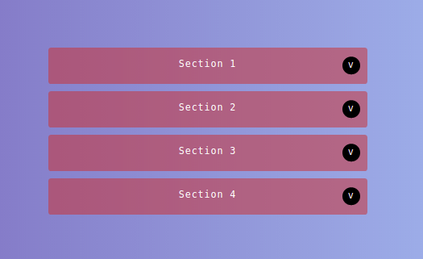

# Adevinta Frontend Challenge

## Instructions

Create an accordion (JS / CSS) show only the contents of a section at a time. More details: (https://github.com/scm-spain/Frontend-Exercise).

## My 1.0.0 Accordion



## Requirements

You have to install [Node.js](https://nodejs.org/) & [Gulp](https://gulpjs.com)

1. Download or clone the repository
2. Install local dependencies with `npm install`
3. Launch the kit with `gulp`
4. If you have some problems, install `gulp cli` with `npm install --global gulp-cli`

### Web server for the development

```
npm start
```

or in the project:

```
gulp
```

Launch a webserver with BrowserSync & some watchers are waiting for the files SCSS/JS/HMTL, in the folder **public/**, for update the browser when you want.

### Ready version for upload to production

For generate the folders for production, you have to do this:

```
npm run docs
```

or in the project:

```
gulp docs
```

---

With this command you can generate the ready files for production and automatically upload to GitHub:

```
npm run push-docs
```

## Project structure

```
/
`- _src
   |- api
   |  |- data.json
   |- assets
   |  |- icons
   |  |- images
   |  |- js
   |  `- scss
   |     `- core
   |
   `- templates
      `- partials

```

## Developed with:

- HTML
- Sass
- JavaScript
- Gulp task automation
